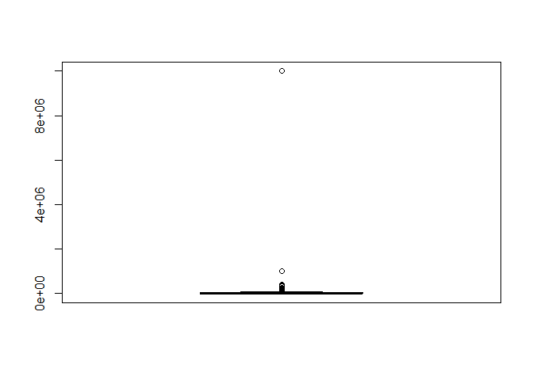
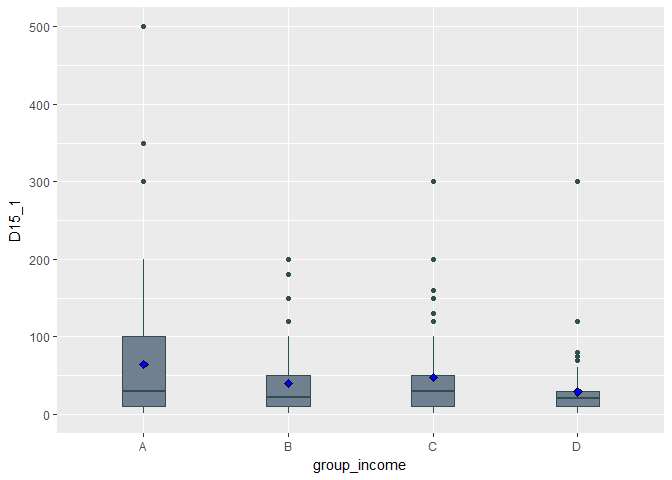

60160493 황수민
================

초록
====

서울 시민의 복지수준을 파악하고 복지사업의 성과를 모니터링하기 위해 구축된 데이터인 **서울복지실태조사**를 바탕으로 *'가구의 소득 및 자산과 기부경험 간의 연관성'*을 분석하였다. 우선 이상치를 제외한 가계의 총 보유자산의 평균을 구해 총 자산이 평균 이상인 가구들 중 기부경험이 있는 가구들의 비율과, 총 자산이 평균 이하인 가구들 중 기부경험이 있는 가구들의 비율을 비교해 보았다. 그 결과 평균 이상인 가구들 중 기부경험이 있는 가구들의 비율이 평균 이하인 가구들에 비해 약 2배가량 많은 것으로 드러났다. 자산이 아닌 가계 연간 총 소득별로 비교해 본 결과 역시 비슷하게 분석되었다. 즉 가계가 여유로울수록 기부활동이 활발하다는 것을 알 수 있었다. 하지만 단순히 기부 횟수로 기부성향을 분석하는 것에는 한계가 있다고 판단하여 소득별 기부 금액을 분석해 본 결과, 대체로 소득이 많을수록 기부금액이 많지만 중간 계층들 중 그렇지 않은 구간도 있었다. 이를 바탕으로 전체 소득액 대비 기부금이 차지하는 비중을 조사해 본 결과 소득 구간 별 기부성향을 파악할 수 있었다.

분석주제
--------

**서울복지실태조사**를 통해 *'가구의 소득 및 자산과 기부경험 간의 상관관계'*를 분석 해보았다. 서울 시민은 가계의 경제적 여유가 있을수록 기부를 많이 하는지에 대해 분석 해보기 위해 이 주제를 선정하였다. 이를 통해 서울 시민의 저소득층 지원 복지에 대한 인식을 엿볼 수 있고, 저소득층을 지원하기 위한 재원을 마련할 때 소득 계층 별 얼마큼의 기부의사가 있는지 파악 가능해 계층별 적정 부과세율 등을 파악하는 데에 도움이 될 것이라고 생각하였다.

데이터 선정
-----------

서울연구원에서 총괄 및 진행하고 닐슨코리아에서 조사한 **2015서울복지실태조사 데이터**를 이용하였다. 출처: <http://data.si.re.kr/sisurvey2015er17>

분석
----

### 1. 총 보유자산에 따른 기부경험

##### 1) 분석하고자 하는 데이터를 데이터 프레임에 할당하기

``` r
library(readxl)
seoul <- read_excel("2015_서울복지실태조사_데이터.xlsx")
```

##### 2) 총 보유자산이 많고 적음의 기준 정하기

``` r
summary(seoul$B16_Total)
```

    ##    Min. 1st Qu.  Median    Mean 3rd Qu.    Max. 
    ##       0    9200   24300  262616   43000 9999999

> 총 보유자산의 편차가 매우 커 평균이 지나치게 커지게 되는 문제가 생겨 이상치를 결측 처리 한 후 평균을 구해보기로 하였다.

##### 3) 이상치를 처리하기 위해 boxplot으로 알아보기

``` r
library(ggplot2)
boxplot(seoul$B16_Total)
boxplot(seoul$B16_Total)$stats
```



    ##       [,1]
    ## [1,]     0
    ## [2,]  9200
    ## [3,] 24300
    ## [4,] 43000
    ## [5,] 93500

``` r
seoul$B16_Total <- ifelse(seoul$B16_Total>=93500,NA,seoul$B16_Total)
```

> boxplot으로 알아본 결과 총 보유자산이 93500(단위=만 원)이 넘으면 이상치로 결측 처리를 하였다.

##### 4) 총 보유자산 별 기부경험 파악하기

``` r
library(dplyr)
mean(seoul$B16_Total,na.rm = T)
```

    ## [1] 25575.28

``` r
seoul %>% 
  filter(B16_Total>=25575.28) %>% 
  dim
```

    ## [1] 1227  828

``` r
seoul %>% 
  filter(B16_Total>=25575.28, D15==1|D15==2) %>% 
  summarise(n=(n()/1227)*100)
```

    ## # A tibble: 1 x 1
    ##       n
    ##   <dbl>
    ## 1  23.2

``` r
seoul %>% 
  filter(B16_Total<25575.28) %>%
  dim
```

    ## [1] 1566  828

``` r
seoul %>% 
  filter(B16_Total<25575.28, D15==1|D15==2) %>% 
  summarise(n=(n()/1566)*100)
```

    ## # A tibble: 1 x 1
    ##       n
    ##   <dbl>
    ## 1  11.5

> 총 보유자산이 특수하게 많은 이상치들은 결측 처리를 한 후 다시 산출한 평균값을 기준으로 하여 정기적, 비정기적으로 기부를 한 경험이 있는 가구들의 비율을 분석해 보았다. 그 결과 총 보유자산이 평균보다 많은 경우 **23.2%**가 기부를 한 경험이 있고 보유자산이 평균보다 적은 경우 **11.5%**가 기부를 한 경험이 있어 보유자산이 많은 가구가 그렇지 않은 가구에 비해 기부 경험이 약 2배정도 많게 분석되었다.

### 2. 연간 총 소득 별 기부경험 파악하기

> 자산은 가구의 경제 상황의 여유를 파악하는 데에는 한계가 있을 수도 있다고 생각하였다. 소득은 그대로이거나 은퇴 후 오히려 소득이 없는 상황임에도 불구하고 가지고 있는 부동산의 가격이 올라 보유자산이 많아지는 경우가 있을 수도 있기 때문이다. 따라서 연간 총 소득 별 기부경험도 파악해 보기로 하였다.

##### 1) 연간 총 소득이 많고 적음의 기준 정하기

``` r
summary(seoul$B10_Total) 
```

    ##    Min. 1st Qu.  Median    Mean 3rd Qu.    Max. 
    ##       0    2400    4000   31898    6000  999999

> 총 자산과 마찬가지로 편차가 매우 커 평균이 지나치게 커지는 문제가 발생해 이를 해결하기 위해 이상치를 결측 처리 한 후 평균을 구해보기로 하였다.

##### 2) 이상치를 처리하기 위해 boxplot으로 알아보기

``` r
boxplot(seoul$B10_Total)
boxplot(seoul$B10_Total)$stats
```


    ##       [,1]
    ## [1,]     0
    ## [2,]  2400
    ## [3,]  4000
    ## [4,]  6000
    ## [5,] 11200

``` r
seoul$B10_Total <- ifelse(seoul$B10_Total>=11200,NA,seoul$B10_Total)
```

> boxplot으로 알아본 결과 연간 총 소득이 11200(단위=만 원)이 넘으면 이상치로 판단하여 결측 처리를 하였다.

##### 3) 연간 총 소득 별 기부경험 파악하기

``` r
mean(seoul$B10_Total, na.rm = T)
```

    ## [1] 4027.928

``` r
seoul %>% 
  filter(B10_Total>=4027.928) %>% 
  dim
```

    ## [1] 1256  828

``` r
seoul %>% 
  filter(B10_Total>=4027.928,  D15==1|D15==2) %>% 
  summarise(n=(n()/1256)*100)
```

    ## # A tibble: 1 x 1
    ##       n
    ##   <dbl>
    ## 1  24.2

``` r
seoul %>% 
  filter(B10_Total<4027.928) %>% 
  dim
```

    ## [1] 1607  828

``` r
seoul %>% 
  filter(B10_Total<4027.928,  D15==1|D15==2) %>% 
  summarise(n=(n()/1607)*100)
```

    ## # A tibble: 1 x 1
    ##       n
    ##   <dbl>
    ## 1  11.4

> 연간 총 소득이 특수하게 많은 이상치들은 결측처리 한 후 다시 산출한 평균값을 기준으로 정기적 혹은 비정기적으로 기부를 한 경험이 있는 가구들의 비율을 분석해 보았다. 그 결과 연간 총 소득이 평균보다 많은 경우 **24.2%**가 기부를 한 경험이 있고, 연간 총 소득이 평균보다 적은 경우 **11.4%**가 기부를 한 경험이 있어 보유자산과 마찬가지로 연간 총 소득이 많은 가구가 그렇지 않은 가구에 비해 기부경험이 두 배 이상 많은 것으로 분석되었다.

### 3. 소득 별 기부금액 분석하기

> 그렇다면 가구의 연간 총 소득 별 기부금액은 어떤 차이가 있는지 분석해보았다. 소득이 많을수록 기부 횟수는 많아도 그 금액은 적을 수 있고 횟수는 적지만 그 금액은 많을 수도 있기 때문이다.

##### 1) 소득을 구간별로 나누기

``` r
seoul_1 <- seoul %>% 
  filter(D15==1|D15==2)
summary(seoul_1$B10_Total)
```

    ##    Min. 1st Qu.  Median    Mean 3rd Qu.    Max.    NA's 
    ##      70    3500    5000    5071    7000   11000      43

``` r
seoul_1$group_income <- ifelse(seoul_1$B10_Total>=7000,"A",
                            ifelse(seoul_1$B10_Total>=5071,"B",
                                   ifelse(seoul_1$B10_Total>=3500,"C","D")))
```

> 우선 기부경험이 있는 가구들을 *seoul\_1*이라는 데이터 프레임에 할당한 후, 3분위 사수 이상은 "A", 평균 이상은 "B", 1분위사수 이상은 "C", 나머지는 "D" 그룹으로 나눠주었다.

##### 2) 각 그룹 별 기부금액 파악하기

``` r
seoul_1 %>% 
  group_by(group_income) %>% 
  summarise(mean_don=mean(D15_1)) %>% 
  filter(!is.na(group_income))
```

    ## # A tibble: 4 x 2
    ##   group_income mean_don
    ##   <chr>           <dbl>
    ## 1 A                64.7
    ## 2 B                40.2
    ## 3 C                48.0
    ## 4 D                29

``` r
ggplot(data=seoul_1, aes(x=group_income, y=D15_1))+ 
  geom_boxplot(fill='slategrey',color='darkslategrey',width=0.3)+
  stat_summary(fun.y="mean", geom="point", shape=23, size=2, fill="blue") +
  xlim("A","B","C","D")+
  ylim(0,500)
```



> 연간 총 소득그룹 별로 기부금액을 알기 쉽게 boxplot그래프를 통해 파악해 보았다. 그 결과 대체적으로 상위 그룹일수록 기부금액이 많은 것으로 드러났다.

``` r
seoul_1 %>% group_by(group_income) %>% 
  summarise(per=(sum(D15_1)/sum(B10_Total)*100)) %>% 
  filter(!is.na(group_income))
```

    ## # A tibble: 4 x 2
    ##   group_income   per
    ##   <chr>        <dbl>
    ## 1 A            0.791
    ## 2 B            0.682
    ## 3 C            1.12 
    ## 4 D            1.39

> 단순히 기부금액을 파악하는 것으로는 각 소득계층 별 기부성향을 파악하는 데에 한계가 있다고 생각하여 소득 계층 별 소득 대비 기부금액의 비중을 알아보았다. 그 결과 소득이 낮은 집단이 많은 집단보다 소득 중 기부금액의 비중이 높은 것으로 드러났다.

결론
----

*'가구의 소득 및 자산과 기부경험 간의 상관관계'*를 분석해 본 결과 자산이나 소득이 많은 집단일수록 기부 횟수가 많은 것으로 드러났다. 즉 가계에 여유가 있을수록 기부를 더 자주 하는 것이다. 또한 소득이 많을수록 절대적인 기부금액도 많은 것으로 분석되었다. 하지만 전체 소득에서 기부금액이 차지하는 비중을 살펴보면 소득이 적은 그룹일수록 높은 것을 볼 수 있다. 이는 소득이 적은 계층일수록 기부성향이 강하다는 것을 보여준다. 이런 현상의 인과관계는 좀 더 정확한 분석을 해봐야 알 수 있을 것이다.
이번 분석의 결과로 소득이나 보유자산에 따른 기부성향을 파악할 수 있었다. 또한 전체적으로 서울시민 중 정기적, 비정기적인 기부경험이 있는 시민의 비중은 대략 17.5%정도에 불과하고 소득 대비 기부금의 비중도 0~1%대라는 것을 알게 되었다. 이는 국민 2/3가 정기적인 기부를 하는 미국이나 국민의 70%이상이 정기적인 기부에 참여하는 영국 등 여타 OECD국가들에 한참 못 미치는 수준이다. 이를 개선하기 위해서는 고소득층의 소득 대비 기부금액이 확대되어 기부문화가 확산되어야 하고 이를 이끌어 낼 수 있는 획기적인 저소득층 지원 정책이 마련되어야 할 것이다. 필자는 이후 가장 효율적인 저소득층 지원을 위해서 각 소득계층 별 어떤 세율을 부과하고 어떤 정책을 펼쳐야 하는지 조사해 볼 것이다.
